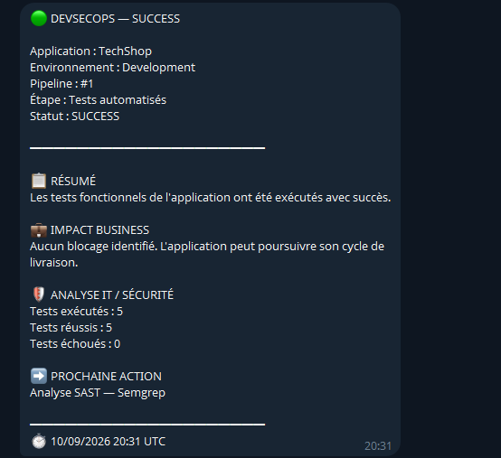
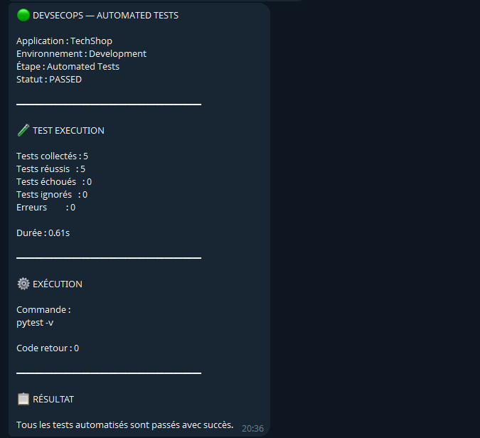
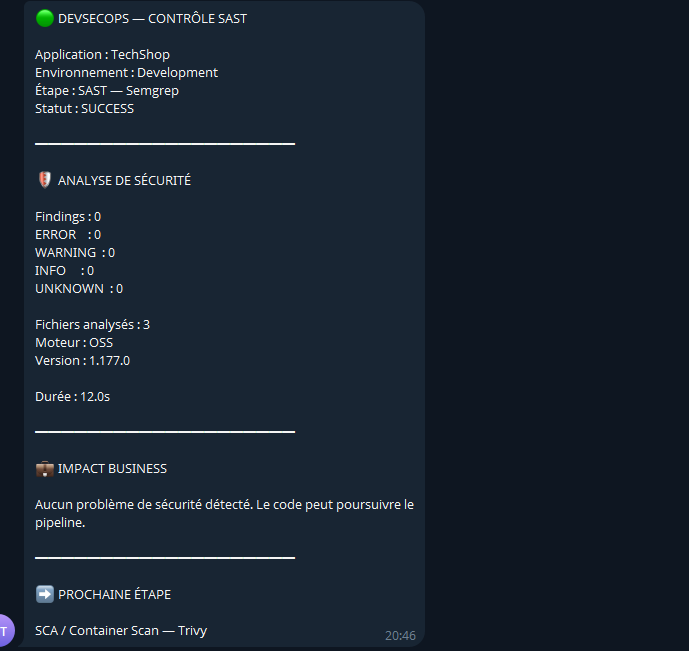
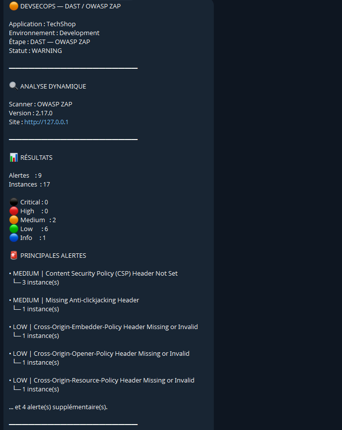

# Automated Security Pipeline

Automated security pipeline for a Flask e-commerce application integrating automated testing, static application security testing, software composition analysis, container security, dynamic application security testing and operational notifications.

The project demonstrates how security controls can be integrated throughout the application delivery lifecycle using open-source technologies.

## Overview

The pipeline automates the following security and quality controls:

```text
Application change
       |
       v
Automated tests
       |
       v
SAST — Semgrep
       |
       v
SCA / Vulnerability scanning — Trivy
       |
       v
Docker image build
       |
       v
Docker Compose deployment
       |
       v
Health check
       |
       v
DAST — OWASP ZAP
       |
       v
JSON security reports
       |
       v
Telegram notifications
```

The objective is to provide a reproducible security workflow where each stage produces measurable results and can communicate its status to technical and business stakeholders.

## Objectives

* Automate application testing and security analysis.
* Detect source-code security issues with SAST.
* Identify vulnerable software dependencies and container components.
* Build and deploy the application using Docker.
* Validate application availability after deployment.
* Perform dynamic security testing against the deployed application.
* Generate structured JSON reports.
* Send stage results through Telegram.
* Centralize pipeline execution in a Python orchestrator.
* Maintain a reproducible and version-controlled security process.

## Application

The project uses a lightweight Flask e-commerce application exposing:

| Endpoint        | Description                 |
| --------------- | --------------------------- |
| `/`             | E-commerce web interface    |
| `/products`     | Product listing             |
| `/product/<id>` | Product details             |
| `/health`       | Application health endpoint |

The application is served with Gunicorn and exposed through an Nginx reverse proxy.

## Architecture

```text
                         +----------------------+
                         |   Developer Change   |
                         +----------+-----------+
                                    |
                                    v
                         +----------------------+
                         | Python Orchestrator  |
                         +----------+-----------+
                                    |
              +---------------------+---------------------+
              |                     |                     |
              v                     v                     v
        +-----------+         +-----------+         +-----------+
        |  Pytest   |         |  Semgrep  |         |  Trivy   |
        |   Tests   |         |   SAST    |         | SCA/Vuln  |
        +-----------+         +-----------+         +-----------+
              |                     |                     |
              +---------------------+---------------------+
                                    |
                                    v
                         +----------------------+
                         |     Docker Build     |
                         +----------+-----------+
                                    |
                                    v
                         +----------------------+
                         |    Docker Compose    |
                         +----------+-----------+
                                    |
                                    v
                         +----------------------+
                         |  Nginx -> Gunicorn   |
                         |       -> Flask       |
                         +----------+-----------+
                                    |
                                    v
                         +----------------------+
                         |     Health Check     |
                         +----------+-----------+
                                    |
                                    v
                         +----------------------+
                         |    OWASP ZAP DAST    |
                         +----------+-----------+
                                    |
                                    v
                         +----------------------+
                         |    JSON Reports      |
                         +----------+-----------+
                                    |
                                    v
                         +----------------------+
                         | Telegram Notification |
                         +----------------------+
```

## Project Structure

```text
automated-security-pipeline/
├── app/
│   ├── app.py
│   ├── requirements.txt
│   └── templates/
│       └── index.html
│
├── tests/
│   └── test_app.py
│
├── nginx/
│   └── default.conf
│
├── scripts/
│   ├── pipeline.py
│   ├── pytest_report.py
│   ├── semgrep_report.py
│   ├── trivy_report.py
│   ├── zap_report.py
│   └── notify.py
│
├── reports/
│   ├── pytest.json
│   ├── semgrep_report.json
│   ├── trivy.json
│   ├── zap_report.json
│   ├── trivy-fs.json
│   ├── trivy-image.json
│   ├── zap.json
│   └── zap.html
│
├── screenshots/
│   └── telegram/
│       ├── 01-pytest.png
│       ├── 02-semgrep.png
│       ├── 03-trivy.png
│       └── 04-zap.png
│
├── Dockerfile
├── docker-compose.yml
├── .dockerignore
├── .gitignore
└── README.md
```

## Automated Testing

Pytest is used to validate the main application endpoints before security analysis and deployment.

The test suite covers:

* Application homepage.
* Product listing.
* Product retrieval.
* Invalid product handling.
* Application health endpoint.

Current test suite:

```text
5 tests passed
```

The result is exported to:

```text
reports/pytest.json
```

## Static Application Security Testing

Semgrep performs static security analysis on the application source code.

Command used by the pipeline:

```bash
semgrep --config=auto --json --exclude=__pycache__ --exclude=*.pyc app/
```

The project currently generates a normalized security report containing:

* Scanner status.
* Exit code.
* Number of findings.
* Scanner errors.
* Files scanned.
* Semgrep version.
* Execution duration.
* Raw scanner output.

Report:

```text
reports/semgrep_report.json
```

## Software Composition Analysis and Container Security

Trivy is used at two levels.

### Filesystem scanning

The application source and its dependencies are scanned for known vulnerabilities.

```bash
trivy fs \
  --scanners vuln \
  --format json \
  --output reports/trivy-fs.json \
  app/
```

### Container image scanning

The Docker image is scanned after the image build.

```bash
trivy image \
  --scanners vuln \
  --format json \
  --output reports/trivy-image.json \
  automated-security-pipeline:latest
```

The results are consolidated into:

```text
reports/trivy.json
```

The normalized report provides:

* Critical vulnerabilities.
* High vulnerabilities.
* Medium vulnerabilities.
* Low vulnerabilities.
* Unknown severity vulnerabilities.
* Scanner errors.
* A global security status.

The pipeline does not hide vulnerabilities detected by the scanner. Results are preserved as generated by the security tooling and exposed through the normalized report.

## Docker

The application is packaged using a Python 3.10 slim image.

The container runs Gunicorn:

```text
gunicorn --bind 0.0.0.0:5000 app:app
```

Docker Compose manages the application and reverse proxy services.

Services:

```text
ecommerce-app
ecommerce-nginx
```

Nginx exposes the application on port 80 and forwards requests to the Flask application running on port 5000.

## Deployment

The pipeline performs the deployment with:

```bash
docker compose up -d --build
```

After deployment, the application is validated using:

```bash
curl -fsS http://127.0.0.1/health
```

A successful response confirms that the application is available through the reverse proxy.

Expected response:

```json
{
  "status": "healthy",
  "service": "ecommerce-api"
}
```

## Dynamic Application Security Testing

OWASP ZAP performs dynamic security testing against the deployed application.

The pipeline uses the ZAP baseline scanner:

```bash
zap-baseline.py \
  -t http://127.0.0.1 \
  -J zap.json \
  -r zap.html
```

The generated reports are:

```text
reports/zap.json
reports/zap.html
reports/zap_report.json
```

The normalized JSON report includes:

* Alert count.
* Severity distribution.
* Alert types.
* Alert instances.
* Scanner status.
* Raw ZAP results.

The current scan detects security hardening opportunities including HTTP security headers and server information exposure.

## Security Reports

Each security stage generates a structured report.

```text
reports/
├── pytest.json
├── semgrep_report.json
├── trivy.json
└── zap_report.json
```

This allows the pipeline results to be consumed by other systems or integrated into future dashboards and CI/CD workflows.

## Telegram Notifications

The pipeline sends notifications after individual stages.

The notification component reads credentials from environment variables rather than storing secrets in the source code.

Required variables:

```text
TELEGRAM_BOT_TOKEN
TELEGRAM_CHAT_ID
```

The variables are stored locally in:

```text
.env
```

The `.env` file is excluded from Git using `.gitignore`.

Telegram notifications provide stage-level information such as:

* Pipeline stage.
* Security tool.
* Execution status.
* Findings or test results.
* Relevant technical information.
* Execution timestamp.

## Notification Examples

### Automated Tests



### SAST with Semgrep



### SCA and Container Security



### DAST with OWASP ZAP



## Pipeline Orchestrator

The complete workflow is controlled by:

```text
scripts/pipeline.py
```

The orchestrator:

1. Executes automated tests.
2. Generates the Pytest report.
3. Sends the corresponding notification.
4. Runs Semgrep.
5. Generates the SAST report.
6. Runs Trivy filesystem analysis.
7. Builds the Docker image.
8. Scans the Docker image.
9. Generates the consolidated Trivy report.
10. Deploys the application with Docker Compose.
11. Performs the health check.
12. Runs OWASP ZAP.
13. Generates the DAST report.
14. Sends the final notification.
15. Displays the overall pipeline status.

Stages are stopped when a blocking failure occurs.

Security scanners such as Trivy and OWASP ZAP can report warnings without being treated as an infrastructure failure, allowing the pipeline to preserve and communicate the detected security findings.

## Installation

Clone the repository:

```bash
git clone git@github.com:r06u3-004/automated-security-pipeline.git
cd automated-security-pipeline
```

Create the Python virtual environment:

```bash
python3 -m venv .venv
source .venv/bin/activate
```

Install the application dependencies:

```bash
pip install -r app/requirements.txt
```

Install the project testing dependency:

```bash
pip install pytest
```

Install the required security tools:

```text
Docker
Docker Compose
Semgrep
Trivy
OWASP ZAP
curl
Python 3
```

## Configuration

Create a local `.env` file:

```env
TELEGRAM_BOT_TOKEN=your_bot_token
TELEGRAM_CHAT_ID=your_chat_id
```

Protect the file:

```bash
chmod 600 .env
```

The `.env` file must never be committed to Git.

## Execution

Run the complete pipeline:

```bash
python scripts/pipeline.py
```

The pipeline displays the execution status of every stage directly in the terminal.

Individual components can also be executed independently.

Pytest:

```bash
python scripts/pytest_report.py
```

Semgrep:

```bash
python scripts/semgrep_report.py
```

Trivy report generation:

```bash
python scripts/trivy_report.py
```

OWASP ZAP report generation:

```bash
python scripts/zap_report.py
```

Telegram notification:

```bash
python scripts/notify.py reports/zap_report.json
```

## Security of Secrets

No Telegram credentials are stored in the repository.

The project uses:

```text
.env
```

for local configuration, and `.gitignore` prevents this file from being tracked.

Before pushing changes to GitHub, verify:

```bash
git ls-files .env
```

The command must return no output.

For production CI/CD, the environment variables should be migrated to the CI/CD platform's secret-management mechanism.

## Technologies

| Category                     | Technology       |
| ---------------------------- | ---------------- |
| Application                  | Python, Flask    |
| Application server           | Gunicorn         |
| Reverse proxy                | Nginx            |
| Testing                      | Pytest           |
| SAST                         | Semgrep          |
| SCA / Vulnerability scanning | Trivy            |
| Containerization             | Docker           |
| Orchestration                | Docker Compose   |
| DAST                         | OWASP ZAP        |
| Automation                   | Python           |
| Notifications                | Telegram Bot API |
| Version control              | Git              |
| Repository                   | GitHub           |

## Skills Demonstrated

This project demonstrates practical experience in:

* DevSecOps pipeline design.
* Security automation.
* Python scripting.
* Automated testing.
* Static application security testing.
* Software composition analysis.
* Container security.
* Docker image management.
* Docker Compose deployment.
* Reverse proxy configuration.
* Dynamic application security testing.
* Security report normalization.
* Security findings analysis.
* Notification automation.
* Secrets management.
* Git and GitHub workflow.
* Security controls integration into application delivery.

## Future Improvements

Planned improvements include:

* GitHub Actions integration.
* Automated pipeline execution on every push.
* GitHub Secrets integration.
* Security gates based on vulnerability severity.
* Automated artifact retention.
* Centralized security dashboard.
* Container image hardening.
* Nginx security header hardening.
* Dependency update automation.
* Automated PDF security reports.
* Historical security metrics.
* Integration with incident-response platforms.

## Project Status

Current implementation includes:

* Flask application.
* Automated tests.
* Semgrep SAST.
* Trivy filesystem scanning.
* Trivy container scanning.
* Docker build.
* Docker Compose deployment.
* Application health check.
* OWASP ZAP DAST.
* JSON security reports.
* Telegram stage notifications.
* Python pipeline orchestration.

The project is actively being improved toward a complete CI/CD-integrated DevSecOps security workflow.

## License

This project is intended for educational, demonstration and professional portfolio purposes.
